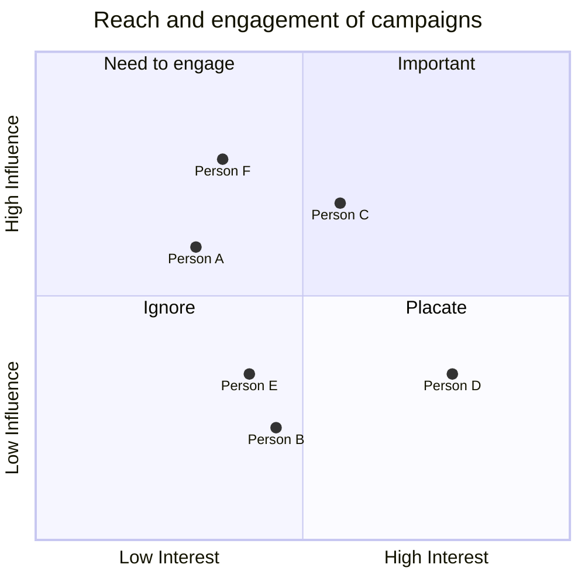

# Modelling

## Problem statement
What is the scope of our model - what boundaries do I need to establish?
Every system is part of a larger system!

- what is the minimum you can model to answer the question?
- If I need to model other systems, how can I simplify their representation?

_simple models are often best_

Start simple, add details if and only if you absolutely have to!


### Details?
How much detail do I need to put into the model? Restrict, simplify, reduce. 

### Assumptions and simplifications

#### Assumptions are things we don't know, or cannot know
Assume that our data is representative
#### Simplification
We choose to simplify because we don't believe the added complexity will provide benefit and could worsen performance.
E.g. reduce the triage process to a single time, not looking into details within
E.g have arrivals as "ambulance" or "other"
```
"All models are wrong, but some are useful" George EP Box, statistician. 
```

Important to distinguish between simple models - give a sense of where you are going, what is happening; and high fidelity models that estimate where you are, where you are going etc very precisely 


### Process Mapping
Important step in _Discrete event analysis_ 

Always remember simple rule "__Say what you see__"

Process map as a team

Think about the journey of the "entities" i.e. patients, tests results, telephone calls, whatever.

####
Visualising process maps usually in some kind of flow map. Diamonds for decisions, entry points and exit points, rectangles for processes. 

Cpature a really big process map but _then_ simplify as a model.

## "What if?" questions

## Deliverables
eg a model, or an envisionable model (eg webapp)
## Organisational impact

You need to know who your stakeholders are: who will benefit, who will be hurt? Need to build engagement other                 wise your model will sit on the shelf!

Who will help, who will hinder? Potential conflicts?

Think of interest/influence diagram:




Patient and public involvement - PPI is important because:
- justice
- quality
- focus

How?

- Include in discussion about ideas
- part of mapping team
- help read specification and outputs

How to approach?

- Patient councils and groups
- social support groups
- advertise on social media?
- schools and colleges?

<https://arc-swp.nihr.ac.uk/patient-public-involvement-engagement/>

## Distributions

Use named distributions eg exponential distribution is typically used to model the time between discrete events that are happening continuously, independently from each other, using lambda (= 1/mean) 

Other is log-normal used for process time. Start with exponential for first draft (faster, simpler).

## Validation and Verification

valid - is the representation good enough?

verification - does the design match the maths?

Black box validation - does it match real world?

