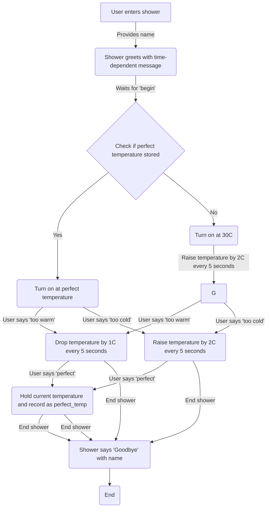

# Exercise

Chalk Showers and Baths Inc has approached you to ask you to design software for a new automated shower system - the Chalk Automated Shower with Genius Responses and Banter (CASH-GRAB) System.

In the new system, the user steps into the shower, and the shower asks them for their name, saying “good morning”, “good afternoon” etc depending on the current time.  It then waits for the user to say “begin”, at which point the shower checks whether the user has a previous perfect temperature stored.  If they do, it turns on at that temperature, and will remain at that temperature until the user says “too warm” or “too cold”.

If the user does not have a perfect temperature stored, the shower turns on at 30C.  The shower continues to raise the water temperature by 2C every 5 seconds (up to a maximum of 42C).  If the user says “too warm”, the shower drops the temperature by 1C every 5 seconds (down to a minimum of 16C).  If the user says “too cold”, the shower again starts raising by 2C every 5 seconds.
If the user says “perfect”, then the shower holds the current temperature, and records it in a variable called perfect_temp, alongside their name in a variable called user_name, and stores both of them in a list called user_preferences.  If the user had a previous perfect temperature, their new temperature overwrites it.  However, they can adjust the temperature in the same way - the only difference is the shower will turn on at their previously stored temperature until a new one is stored.

The shower continues to run until the user says “end shower”, at which point the shower says “Goodbye” followed by their name.
You’ll now split into your groups, and as a group :

Draw a diagram outlining how the system will work, flagging any conditional logic, loops and variable storage
Write a list of the variables that will be used in the system, along with the type of each variable, and a short description of what the variable is storing

If you have time, you should also :

Propose some improvements to the system, and include them on your diagram.

## Python

functions in python are defined with indentation as the body of the function, as is conditional logic. Yuck.

### Object oriented programming

Procedural is do this, do that.

OOP does the same thing under the hood, but is written as though each thing is an _object_ with an _attribute_ and some _methods_ which are functions that relate to a particular __class__ of _objects_. Objects are created as an __instance__ of a class.

In OOP an object has things it _has_, attributes, and things it _does_, methods.

Let’s say we want to write code that defines how an ambulance works.

There will be properties the ambulance has.  Things like :

- The trust it belongs to
- The registration number
- Whether a patient is currently on board
- Whether the siren is currently going off

There will also be things the ambulance does :

- Driving
- Parking
- Having patients loaded into it / out of it
- Switching the siren on and off

In Object Oriented Programming, the things it has are known as attributes and the things it does are methods.

#### CLASS : Ambulance

##### Attributes

name_of_trust : string
reg_number : string
patient_on_board : boolean
siren_on : boolean

##### Methods

drive (speed : float)
park (location : string)
load_patient (patient_name : string)
unload_patient (patient_name : string)
turn_on_siren ()
turn_off_siren ()

#### A constructor

defines what happens when an object is instantiated. Just a method in a class.

#### The Four Pillars of OOP

Encapsulation

Abstraction

Inheritance

Polymorphism
