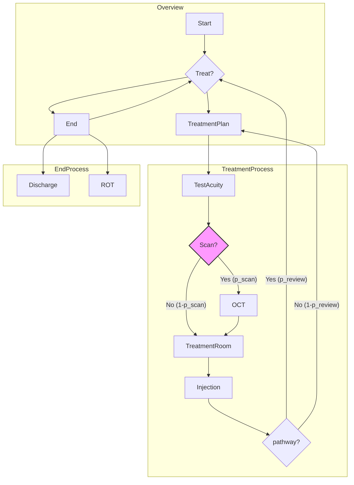

```mermaid
graph TD
    subgraph Overview
        Start  --> Review{Treat?}
        Review --> End
        Review --> TreatmentPlan
    end

    subgraph TreatmentProcess
        TreatmentPlan --> TestAcuity
        TestAcuity --> Decision{Scan?}
        Decision -->|"Yes (p_scan)"| OCT
        Decision -->|"No (1-p_scan)"| TreatmentRoom
        OCT --> TreatmentRoom
        TreatmentRoom --> Injection
        Injection --> InjectionOutcome{pathway?}
        InjectionOutcome -->|"Yes (p_review)"| Review{Treat?}
        InjectionOutcome -->|"No (1-p_review)"| TreatmentPlan
    end

    subgraph EndProcess
        End --> Discharge
        End --> ROT
        End --> Review
    end

    classDef probability fill:#f9f,stroke:#333,stroke-width:2px;
    class Decision probability;
```