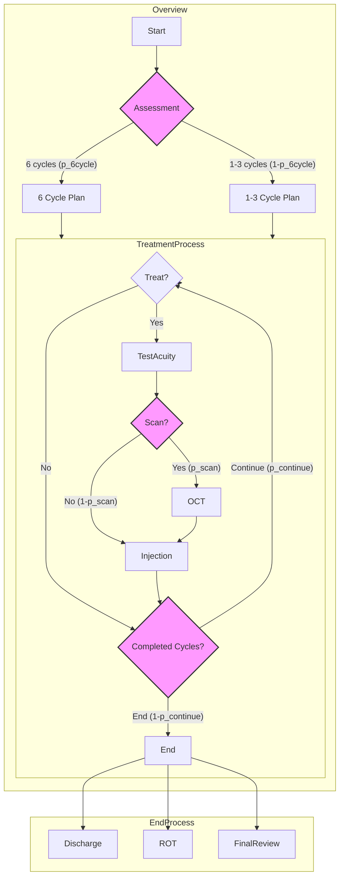

```mermaid
graph TD
    subgraph Overview
        Start --> Assessment{Assessment}
        Assessment -->|"6 cycles (p_6cycle)"| Plan6[6 Cycle Plan]
        Assessment -->|"1-3 cycles (1-p_6cycle)"| Plan13[1-3 Cycle Plan]
        Plan6 --> TreatmentProcess
        Plan13 --> TreatmentProcess
    end

    subgraph TreatmentProcess
        TreatmentProcess --> Review{Treat?}
        Review -->|Yes| TestAcuity
        Review -->|No| CycleCheck
        TestAcuity --> Decision{Scan?}
        Decision -->|"Yes (p_scan)"| OCT
        Decision -->|"No (1-p_scan)"| Injection
        OCT  --> Injection
        Injection --> CycleCheck{Completed Cycles?}
        CycleCheck -->|"Continue (p_continue)"| Review
        CycleCheck -->|"End (1-p_continue)"| End
    end

    subgraph EndProcess
        End --> Discharge
        End --> ROT
        End --> FinalReview
    end

    classDef probability fill:#f9f,stroke:#333,stroke-width:2px;
    class Assessment,Decision,CycleCheck probability;

```