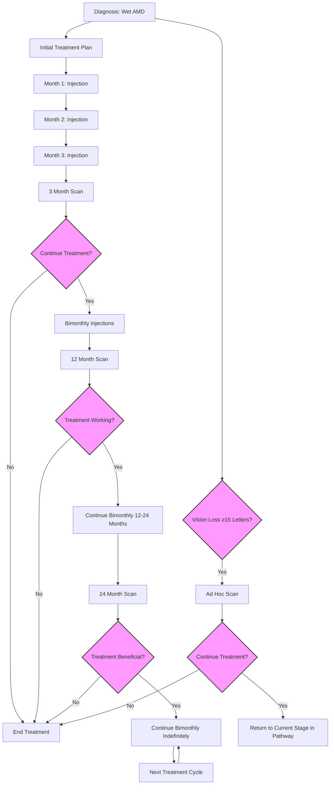

```mermaid
graph TD
    Start[Diagnosis: Wet AMD] --> InitialPlan[Initial Treatment Plan]
    InitialPlan --> Month1[Month 1: Injection]
    Month1 --> Month2[Month 2: Injection]
    Month2 --> Month3[Month 3: Injection]
    Month3 --> Scan3Months[3 Month Scan]
    Scan3Months --> Review3Months{Continue Treatment?}
    Review3Months -->|Yes| BimonthlyInjections[Bimonthly Injections]
    Review3Months -->|No| End[End Treatment]
    
    BimonthlyInjections --> Scan12Months[12 Month Scan]
    Scan12Months --> Review12Months{Treatment Working?}
    Review12Months -->|Yes| Continue12to24[Continue Bimonthly 12-24 Months]
    Review12Months -->|No| End
    
    Continue12to24 --> Scan24Months[24 Month Scan]
    Scan24Months --> Review24Months{Treatment Beneficial?}
    Review24Months -->|Yes| ContinueIndefinitely[Continue Bimonthly Indefinitely]
    Review24Months -->|No| End
    
    ContinueIndefinitely --> NextCycle[Next Treatment Cycle]
    NextCycle --> ContinueIndefinitely
    
    Start --> VisionCheck{Vision Loss ≥15 Letters?}
    VisionCheck -->|Yes| AdHocScan[Ad Hoc Scan]
    AdHocScan --> AdHocReview{Continue Treatment?}
    AdHocReview -->|Yes| ReturnToPathway[Return to Current Stage in Pathway]
    AdHocReview -->|No| End
    
    classDef decision fill:#f9f,stroke:#333,stroke-width:2px;
    class Review3Months,Review12Months,Review24Months,VisionCheck,AdHocReview decision;
```