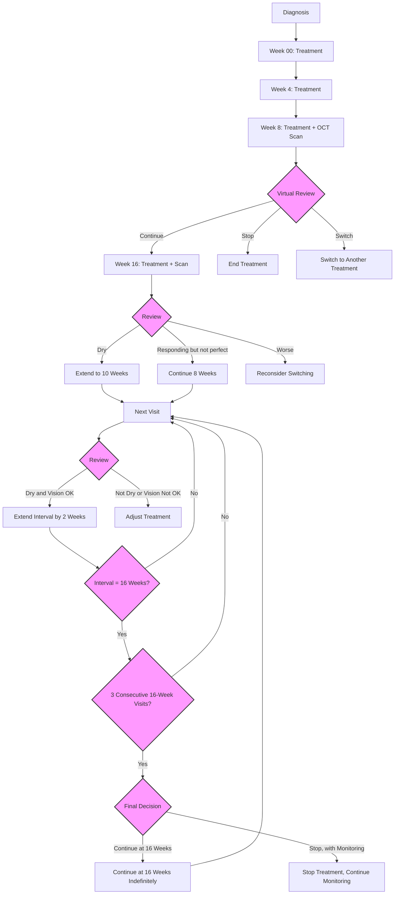

# PV Eylea 2mg pathway

version 0.1

Date: 2024-08-02


# Markdown Rendering Test

Normal text

**Bold text**

*Italic text*

`Inline code`

```
Code block
```

<div style="background-color: yellow; color: black; padding: 10px;">
This is a yellow box with black text.
</div>

<span style="background-color: white; color: black;">This text should have a white background and black color.</span>


---

> This is a blockquote

1. Numbered list item 1
2. Numbered list item 2

- Bullet point 1
- Bullet point 2

| Column 1 | Column 2 |
|----------|----------|
| Cell 1   | Cell 2   |

