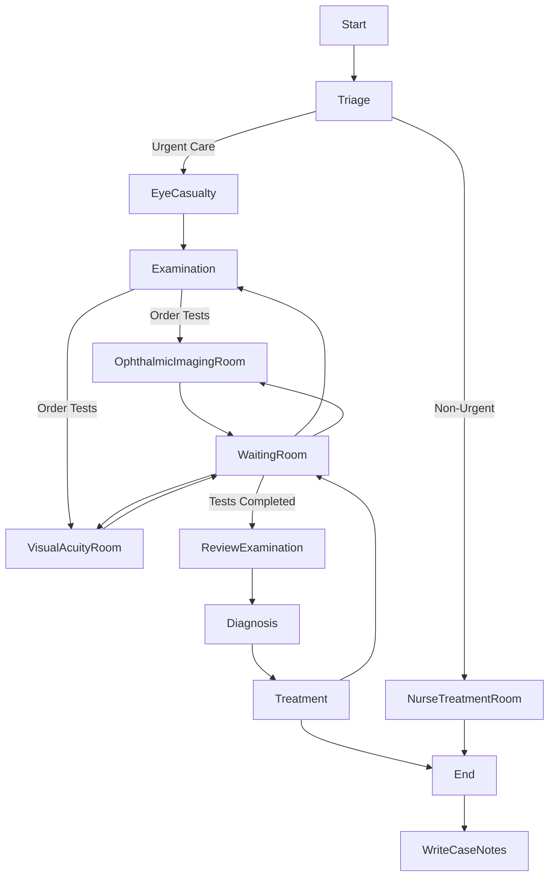

```mermaid
graph TD;
    Start --> Triage;
    Triage --> |Urgent Care| EyeCasualty;
    Triage --> |Non-Urgent| NurseTreatmentRoom;
    EyeCasualty --> Examination;
    Examination --> |Order Tests| OphthalmicImagingRoom;
    Examination --> |Order Tests| VisualAcuityRoom;
    OphthalmicImagingRoom  --> WaitingRoom;  
    VisualAcuityRoom --> WaitingRoom;
    WaitingRoom --> Examination;
    WaitingRoom --> VisualAcuityRoom;
    WaitingRoom --> OphthalmicImagingRoom;
    ReviewExamination --> Diagnosis;
    Diagnosis --> Treatment;
    Treatment --> End;
    End --> WriteCaseNotes;
    NurseTreatmentRoom --> End;
    Treatment --> WaitingRoom;
    WaitingRoom --> |Tests Completed| ReviewExamination;
```

Patients arrive every 8 mins
registration takes 2 mins
Nurse triage 5 mins
cubicle for 30 mins, 3 of

1) How long does patient spend on average
2) Which resource do you increase

