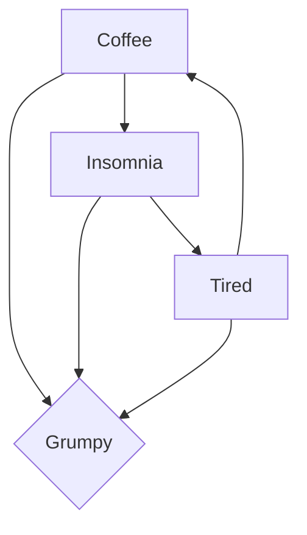
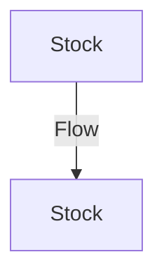
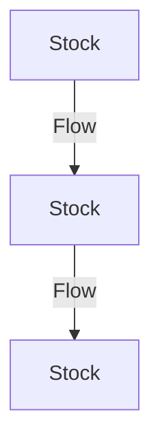

# Using Insight Maker to create a simple system dynamics model

## Causal loop diagrams

A way to map influences with _direction_ and _polarity_ of influences

Quantitive system dynamics models are built on the foundation of causal loop diagrams

## Stock and flow diagrams

However SD models don't look at discrete events, but rather continuous changes over time. Better for flow (like water) rather than events. 

## Building a simple model

Look at the following model:

What about eggs taking 3 weeks to hatch - in SD world each week 1/3 of the egg would hatch.

